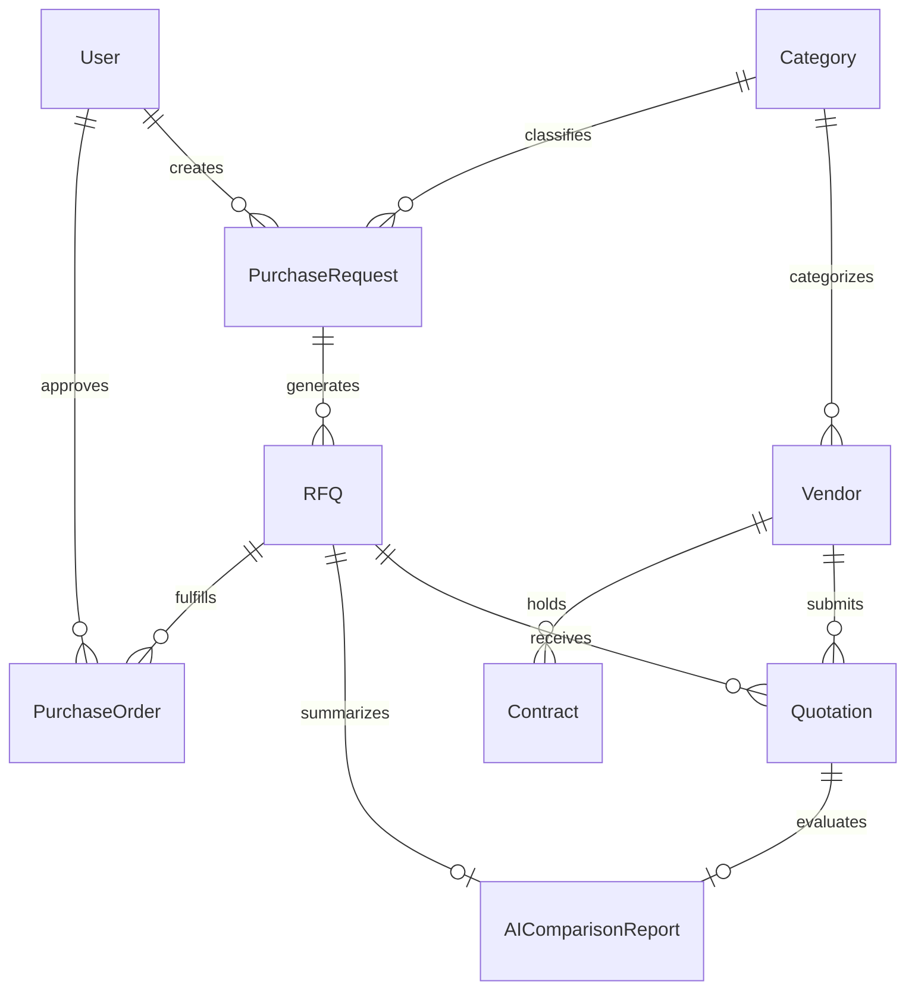

# AI Procurement Copilot — Product Blueprint & Implementation Plan

AI Procurement Copilot is an enterprise-grade AI-powered procurement management SaaS designed for SMBs, manufacturing companies, healthcare facilities, and educational institutions. It streamlines the end-to-end procurement lifecycle—from purchase request creation and vendor RFQ dispatch to automated quotation extraction, multi-dimensional AI quote comparison, contract risk analysis, and real-time spend analytics.

---

## 1. System Architecture & Tech Stack Overview

```
                      +---------------------------------------+
                      |            React + Vite Frontend       |
                      |    (Tailwind CSS / Recharts / Lucide) |
                      +-------------------+-------------------+
                                          |
                                    REST API (JWT)
                                          |
                      +-------------------+-------------------+
                      |      Django REST Framework API        |
                      +----+--------------+---------------+---+
                           |              |               |
             +-------------+--+    +------+-------+   +---+--------------+
             | PostgreSQL DB  |    | Celery Worker|   |  AI Engine       |
             | (with pgvector)|    |  + Redis     |   | (OpenAI / LangChain|
             +----------------+    +--------------+   |  / OCR Parsers)  |
                                                      +------------------+
```

### Backend Stack
- **Framework**: Python 3.13+ with Django 5.x & Django REST Framework (DRF)
- **Database**: PostgreSQL 16+ with `pgvector` extension for vector embeddings & similarity search
- **Task Queue & Caching**: Celery + Redis for async PDF processing, OCR, email dispatch, and AI comparisons
- **Auth**: JWT (SimpleJWT) with Role-Based Access Control (RBAC)
- **Storage**: Local media storage during dev, configurable AWS S3 / Cloudinary for production

### Frontend Stack
- **Framework**: React 18+ (Vite)
- **Styling**: Modern Vanilla CSS Design Tokens + Tailwind CSS for utility layouts, glassmorphism, dark/light themes
- **Charts & Visuals**: Recharts for spend dashboards & vendor analytics
- **State Management**: React Query / Context API for global auth & cached server state

---

## 2. Relational Database Schema & Data Models

### Data Models & Relationships



#### Core Entities Breakdown

1. **`User` (Custom User Model)**
   - `id`: UUID
   - `email`: EmailField (unique login identifier)
   - `first_name`, `last_name`: CharField
   - `role`: Enum (`ADMIN`, `PROCUREMENT_MANAGER`, `VENDOR`, `FINANCE`, `VIEWER`)
   - `organization_name`: CharField
   - `is_active`, `created_at`, `updated_at`

2. **`Category`**
   - `id`: UUID
   - `name`: CharField (e.g., IT Hardware, Office Supplies, Industrial Raw Materials)
   - `code`: CharField (unique SKU/Category code)
   - `description`: TextField

3. **`Vendor`**
   - `id`: UUID
   - `company_name`: CharField
   - `contact_person`: CharField
   - `email`, `phone`: CharField
   - `tax_id` (GST/VAT): CharField
   - `address`, `city`, `country`: CharField
   - `rating`: DecimalField (1.0 to 5.0)
   - `categories`: ManyToManyField(`Category`)
   - `ai_performance_score`: JSONField (Quality score, On-time delivery rate, Price competitiveness score)

4. **`PurchaseRequest`**
   - `id`: UUID
   - `request_number`: CharField (Auto-generated PR-2026-0001)
   - `created_by`: ForeignKey(`User`)
   - `category`: ForeignKey(`Category`)
   - `title`: CharField
   - `items`: JSONField (`[{ item_name, quantity, specs, estimated_unit_cost }]`)
   - `total_budget`: DecimalField
   - `required_by_date`: DateField
   - `priority`: Enum (`LOW`, `MEDIUM`, `HIGH`, `URGENT`)
   - `status`: Enum (`DRAFT`, `PENDING_APPROVAL`, `APPROVED`, `REJECTED`, `RFQ_CREATED`)

5. **`RFQ` (Request for Quotation)**
   - `id`: UUID
   - `rfq_number`: CharField (Auto-generated RFQ-2026-0001)
   - `purchase_request`: ForeignKey(`PurchaseRequest`)
   - `invited_vendors`: ManyToManyField(`Vendor`)
   - `submission_deadline`: DateTimeField
   - `terms_and_conditions`: TextField
   - `status`: Enum (`DRAFT`, `PUBLISHED`, `CLOSED`, `EVALUATED`, `AWARDED`)

6. **`Quotation`**
   - `id`: UUID
   - `rfq`: ForeignKey(`RFQ`)
   - `vendor`: ForeignKey(`Vendor`)
   - `document`: FileField (Uploaded PDF/Excel quote)
   - `extracted_data`: JSONField (`{ line_items, total_price, currency, delivery_time_days, warranty_months, payment_terms, validity_period }`)
   - `ocr_status`: Enum (`PENDING`, `PROCESSING`, `SUCCESS`, `FAILED`)
   - `submitted_at`: DateTimeField

7. **`AIComparisonReport`**
   - `id`: UUID
   - `rfq`: OneToOneField(`RFQ`)
   - `best_price_vendor`: ForeignKey(`Vendor`, related_name='best_price')
   - `fastest_delivery_vendor`: ForeignKey(`Vendor`, related_name='fastest_delivery')
   - `best_overall_vendor`: ForeignKey(`Vendor`, related_name='best_overall')
   - `risk_assessment`: JSONField (`[{ vendor_id, risk_level, risk_factors }]`)
   - `matrix_summary`: JSONField (Extracted structured breakdown across all parameters)
   - `ai_recommendation_text`: TextField (Detailed executive decision summary)

8. **`Contract`**
   - `id`: UUID
   - `title`: CharField
   - `vendor`: ForeignKey(`Vendor`)
   - `document`: FileField
   - `start_date`, `end_date`: DateField
   - `value`: DecimalField
   - `status`: Enum (`DRAFT`, `ACTIVE`, `EXPIRED`, `TERMINATED`)
   - `ai_analysis`: JSONField (`{ missing_clauses: [], risk_penalties: [], payment_terms_risk: "", renewal_notice_days: 30 }`)

9. **`PurchaseOrder`**
   - `id`: UUID
   - `po_number`: CharField
   - `rfq`: ForeignKey(`RFQ`)
   - `selected_vendor`: ForeignKey(`Vendor`)
   - `total_amount`: DecimalField
   - `status`: Enum (`ISSUED`, `ACKNOWLEDGED`, `DELIVERED`, `COMPLETED`, `CANCELLED`)

---

## 3. Core REST API Map

### Auth & User Management (`/api/v1/auth/`)
- `POST /api/v1/auth/register/` - Register user/vendor account
- `POST /api/v1/auth/login/` - Obtain JWT token pair (Access & Refresh)
- `POST /api/v1/auth/refresh/` - Refresh JWT token
- `GET /api/v1/auth/me/` - Retrieve current user profile & role permissions

### Vendor Management (`/api/v1/vendors/`)
- `GET /api/v1/vendors/` - List/filter vendors by category, rating, location
- `POST /api/v1/vendors/` - Create vendor profile
- `GET /api/v1/vendors/{id}/` - Detailed vendor profile & historical analytics
- `PUT/PATCH /api/v1/vendors/{id}/` - Update vendor info

### Purchase Requests & RFQs (`/api/v1/procurement/`)
- `GET/POST /api/v1/procurement/purchase-requests/` - Manage purchase requests
- `POST /api/v1/procurement/purchase-requests/{id}/approve/` - Approve PR
- `GET/POST /api/v1/procurement/rfqs/` - Manage RFQs
- `POST /api/v1/procurement/rfqs/{id}/dispatch/` - Send RFQ invites to vendors via email

### Quotations & AI Extraction (`/api/v1/quotations/`)
- `POST /api/v1/quotations/upload/` - Upload vendor quotation (PDF/Excel)
- `POST /api/v1/quotations/{id}/parse-ai/` - Trigger OCR & LLM extraction on a quotation
- `GET /api/v1/quotations/rfq/{rfq_id}/` - Get all quotations submitted for an RFQ

### AI Engine Endpoints (`/api/v1/ai/`)
- `POST /api/v1/ai/rfq-generate/` - AI-generate RFQ descriptions and specifications from PR items
- `POST /api/v1/ai/quotation-compare/{rfq_id}/` - Run multi-criteria AI comparison matrix
- `POST /api/v1/ai/contract-audit/` - Upload & run AI risk/missing clause detection on contract PDF
- `POST /api/v1/ai/copilot-chat/` - Natural language RAG assistant for spend, vendors, and status questions

### Dashboard & Analytics (`/api/v1/dashboard/`)
- `GET /api/v1/dashboard/metrics/` - Monthly spend, active RFQs, savings achieved, pending orders
- `GET /api/v1/dashboard/spend-by-category/` - Breakdown for chart rendering
- `GET /api/v1/dashboard/top-vendors/` - Rating and volume chart data

---

## 4. AI Engine Pipeline Architecture

```
                                [ PDF / Document Upload ]
                                            |
                                            v
                                 [ PyPDF / pdfplumber ]
                                            |
                              (If Scanned Image PDF -> Tesseract OCR)
                                            |
                                            v
                                  [ Clean Text Content ]
                                            |
                                            v
                                  [ Structured LLM Prompt ]
                                (OpenAI GPT-4o / JSON Mode)
                                            |
                                            v
                            +---------------+---------------+
                            |                               |
                            v                               v
                [ Quotation Structured JSON ]      [ Contract Risk Breakdown ]
                - Prices & Unit rates               - Payment risk flags
                - Delivery timeframe                - Missing indemnity clauses
                - Payment terms & Warranty          - Renewal deadlines & penalties
```

### 1. Quotation Parsing Strategy
- Extract raw text using `pdfplumber` or `pypdf`.
- For image-based PDFs, fallback to `pytesseract` or `easyocr`.
- Pass structured text to OpenAI API with JSON schema enforcement to ensure uniform output for all vendors regardless of PDF layout differences.

### 2. Multi-Criteria AI Decision Engine
When comparing quotations for an RFQ:
- **Best Price Node**: Evaluates total cost, tax inclusions, and bulk discounts.
- **Delivery Risk Node**: Compares lead times against the Purchase Request's `required_by_date`.
- **Commercial Risk Node**: Flags upfront payment demands (e.g. 100% advance vs Net 30/60).
- **Warranty & Support Node**: Scores terms against category benchmarks.
- **Synthesis Node**: Generates an executive summary markdown recommendation + comparison grid.

---

## 5. UI/UX Wireframe & Visual Design System

### Design Aesthetic & Theme
- **Color Palette**:
  - Primary: Deep Navy `#0F172A` & Slate `#1E293B`
  - Accent: Electric Indigo `#6366F1` & Emerald Green `#10B981` (for savings/positive signals)
  - Warning/Risk: Crimson `#EF4444` & Amber `#F59E0B`
  - Background: Clean Dark Mode (`#090D16`) with optional Light Mode toggle
- **Typography**: Inter / Outfit via Google Fonts
- **Visual Touches**: Glassmorphic cards, glowing badge indicators, responsive data tables with instant filters, animated chat interface for AI Copilot.

### Primary Screen Layouts
1. **Executive Dashboard**: KPI counters (Total Spend, Cost Savings, Active RFQs, Pending Deliveries) + Recharts visual cards + Recent AI Alerts.
2. **Purchase Requests & RFQ Hub**: Workflow pipeline view (Draft -> Approval -> RFQ Dispatched -> Bidding -> Awarded).
3. **AI Quote Comparison Matrix**: Dynamic comparison table highlighting Best Price (Green), Fastest Delivery (Blue), and Risk Warning badges (Red/Amber), side-by-side with raw extracted PDF preview.
4. **Contract Risk Audit Studio**: Split view showing document preview on the left and AI Clause Analysis / Penalty Risk Timeline on the right.
5. **AI Procurement Copilot Chat Drawer**: Sliding side panel accessible from anywhere in the app to ask queries like *"Show all vendors with >14 days average lead time"*.

---

## 6. Phased Implementation Strategy

### Phase 1: Core Foundation & Domain Baseline (Current Phase)
- Setup Django project structure & PostgreSQL database integration.
- Implement Custom User model, Role-Based Access Control (RBAC), and SimpleJWT Auth endpoints.
- Build Vendor, Category, and Purchase Request models + DRF serializers & viewsets.
- Create initial React + Vite app with navigation shell, design system tokens, and Auth/Vendor management views.

### Phase 2: Procurement Workflow & RFQs
- Implement RFQ creation, vendor invitation, and Quotation submission models.
- Build Purchase Order lifecycle & status state machines.
- Create interactive React forms for Purchase Requests and RFQ generation.

### Phase 3: AI Engine Integration (Quote Extraction & Comparison)
- Build PDF text extraction and OCR pipeline.
- Implement OpenAI JSON-mode prompt handlers for extracting line items, payment terms, and warranty.
- Build the Multi-Criteria AI Quote Comparison Matrix engine and API endpoints.

### Phase 4: Contract Audit, Spend Analytics & RAG Chatbot
- Implement Contract upload & risk clause detection service.
- Build Spend Analytics API endpoints + Recharts visualization screens.
- Build AI Copilot natural language interface using RAG over spend & procurement DB records.

### Phase 5: Production Polish, Security & Deployment
- Automated test coverage for DRF endpoints and AI parser fallbacks.
- Seed realistic demo data (vendors, sample quotations, sample contracts).
- Config files for Docker, Render/DigitalOcean backend, and Vercel frontend.

---

## User Review Required

> [!IMPORTANT]
> **Key Architectural Decisions for Approval:**
> 1. **AI Provider**: Using OpenAI API (`gpt-4o-mini` / `gpt-4o` for JSON extraction) initially with modular abstraction to support local LLMs (e.g. Ollama/DeepSeek) later.
> 2. **Database**: PostgreSQL 16 with `pgvector` enabled from day 1 to seamlessly support vector search for RAG chat and document querying.
> 3. **Monorepo Layout**: Dual folder layout in `c:\Users\SREERAG\AI procurement`:
>    - `backend/`: Django project (`config`, `apps/accounts`, `apps/vendors`, `apps/procurement`, `apps/quotations`, `apps/contracts`, `apps/ai_engine`, `apps/dashboard`)
>    - `frontend/`: React + Vite SPA

---

## Open Questions

> [!NOTE]
> 1. **Default Currency**: Should we support multi-currency (e.g., INR ₹, USD $, EUR €) with exchange rate normalization, or default to INR ₹ for initial demo data?
> 2. **Vendor Portal**: Should vendors have a dedicated lightweight login portal to upload quotes directly, or can Procurement Managers upload vendor PDF/Excel files on their behalf? (We will support both, but can prioritize manager upload for Phase 1).
